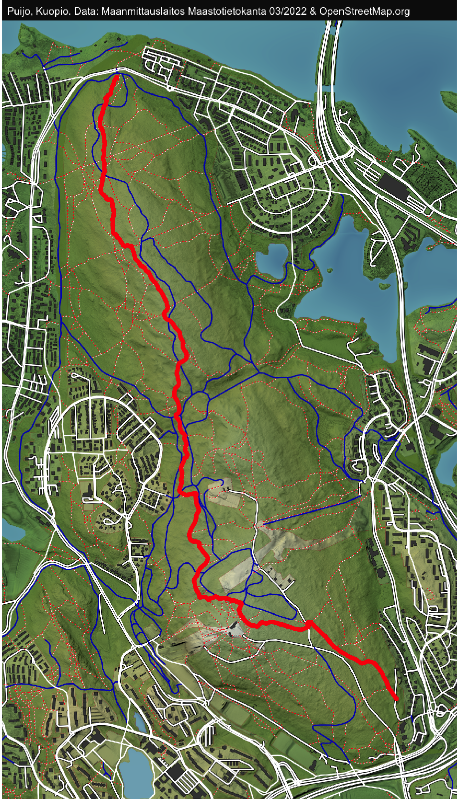
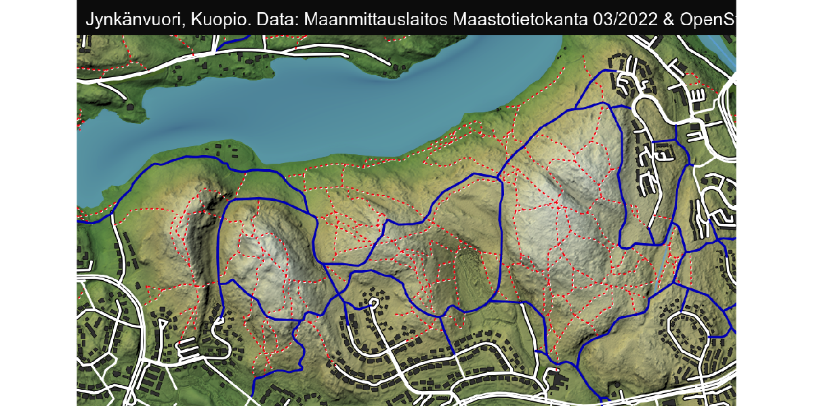
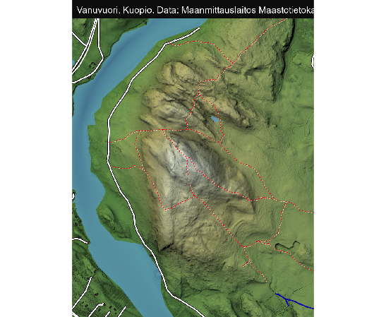

```{r setup, include=FALSE}
knitr::opts_chunk$set(echo = FALSE)
```

## Puijo

<video width="640" height="480" autoplay loop>
  <source src="https://research.janimiettinen.fi/material/trailmaps/img/trailmaps/puijo.mp4" type="video/mp4">
</video>



## Jynkävuori

<video width="640" height="480" autoplay loop>
  <source src="https://research.janimiettinen.fi/material/trailmaps/img/trailmaps/jynkanvuori.mp4" type="video/mp4">
</video>



## Vanuvuori

<video width="640" height="480" autoplay loop>
  <source src="https://research.janimiettinen.fi/material/trailmaps/img/trailmaps/vanuvuori.mp4" type="video/mp4">
</video>

